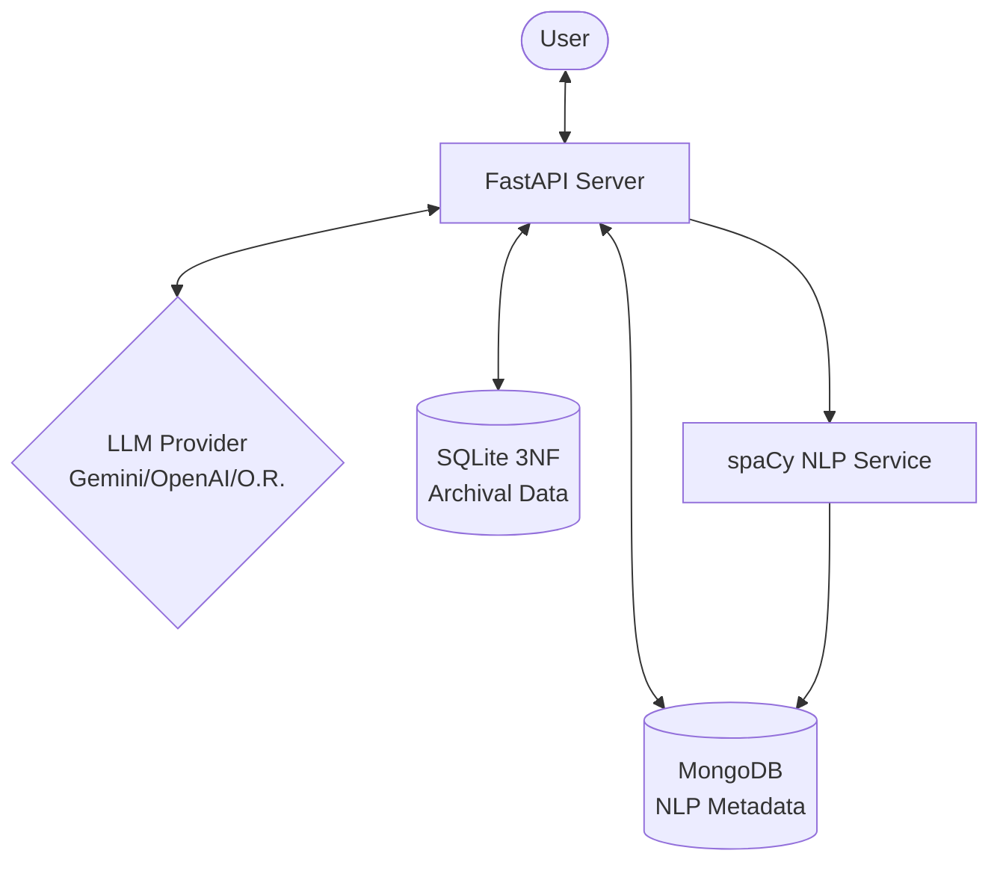

# 🧠 AI-Driven LLM Memory Management System

[](https://fastapi.tiangolo.com/)
[](https://www.python.org/)
[](https://www.mongodb.com/)
[](https://www.sqlite.org/)

A state-of-the-art **Persistent Memory System** for Large Language Models. This project implements a **Hybrid SQL + NoSQL Architecture** to provide LLMs with long-term memory, personality awareness, and structured knowledge extraction.

---

## ✨ Key Features

- **🤖 Multi-Provider LLM Support**: Seamlessly switch between **Gemini (Flash/Pro)**, **OpenAI (GPT-4)**, and **OpenRouter** models.
- **💾 Hybrid Memory Storage**:
  - **SQL (3NF Compliance)**: Structured archival of users, sessions, and conversation logs.
  - **NoSQL (Big Data Ready)**: Unstructured NLP metadata, entity relations, and rich categorization stored in MongoDB.
- **🧠 Context-Aware RAG**: Automatically retrieves relevant past interactions to provide personalized, memory-driven responses.
- **🔍 Advanced NLP Pipeline**:
  - Built-in Named Entity Recognition (NER) with **spaCy**.
  - Automatic classification of memory types: `Facts`, `Preferences`, `Skills`, and `Rules`.
  - Relationship mapping between extracted entities.
- **📊 Real-time Graph Visualization**: Dynamic visualization of user knowledge using **Cytoscape.js**.
- **⚡ Background Processing**: NLP extraction and memory storage happen asynchronously for zero latency in chat.

---

## 🏗️ Architecture Overview

The system bridges the gap between transient LLM sessions and persistent knowledge:



---

## 🚀 Quick Start

1. **Install Dependencies**:
   ```bash
   pip install -r requirements.txt
   python -m spacy download en_core_web_sm
   ```

2. **Configure Environment**:
   Create a `.env` file with your `GEMINI_API_KEY`.

3. **Launch**:
   ```bash
   .\START.bat
   ```

> [!TIP]
> For a detailed walkthrough of the installation process, check out our **[Installation Guide](./INSTALLATION.md)**.

---

## 📡 API Reference

| Endpoint | Description |
| :--- | :--- |
| `POST /api/users` | Register a new user profile |
| `POST /api/conversations` | Send a message and trigger RAG + Memory extraction |
| `GET /api/memory/search` | Full-text search across stored memories |
| `GET /api/settings/models` | List available AI providers and models |

---

## 👥 Project Contributors

| Name | Roll Number |
| :--- | :--- |
| **YADAMREDDY NAVANEETH** | 1RV23CS295 |
| **YUVA T** | 1RV23CS301 |
| **SANVI H S** | 1RV23CS308 |

---

## 📄 License

This system was developed as part of the **DBMS Lab** project. It is designed to demonstrate Advanced Database Integration with Modern AI agents.
